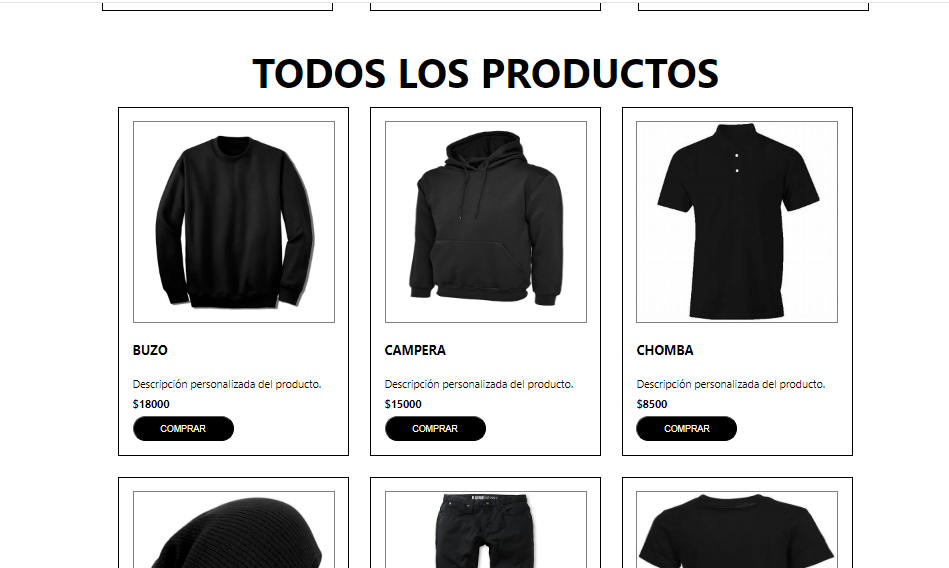
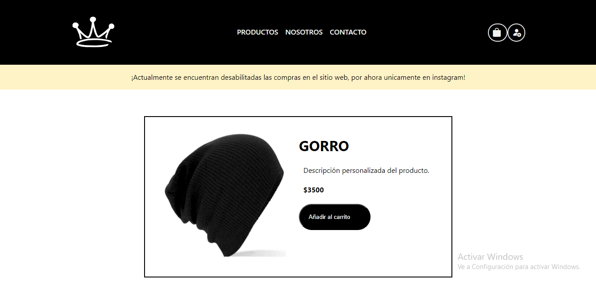
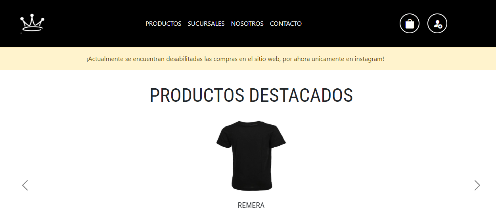
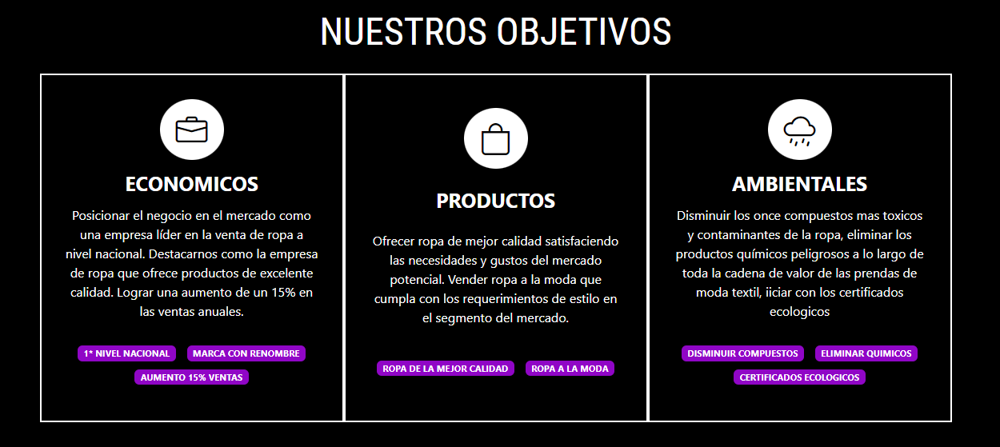

# White Crown

Proyecto para una actividad escolar que escalo hacia  una trabajo final de un curso de Coderhouse en desarrollo web en 2022.

>[!IMPORTANT]
> Acá va ir la versión más actual en la que pienso convertir la primera versión en una aplicación web con carrito de compras, mercado pago, cuenta, etc.

>[!NOTE]
> En esta segunda versión se mejoraron defectos de la primera version, además de eso se utilizó webcomponents para las cards de los productos 
> y Tailwind para los estilos.

Imágenes v2:

>[!NOTE]
> La primera versión es estática únicamente utilizando HTML y CSS con SCSS

Imágenes v1:

